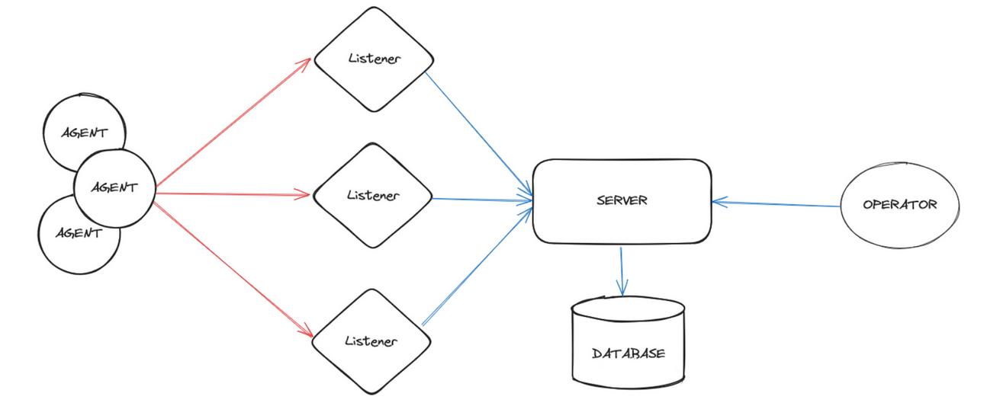
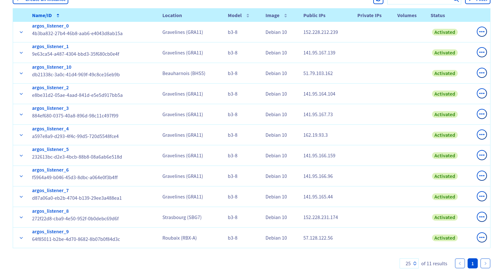
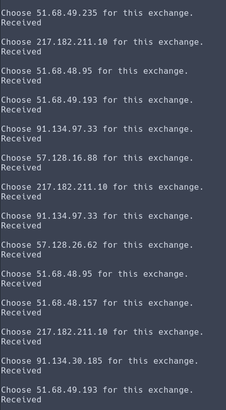
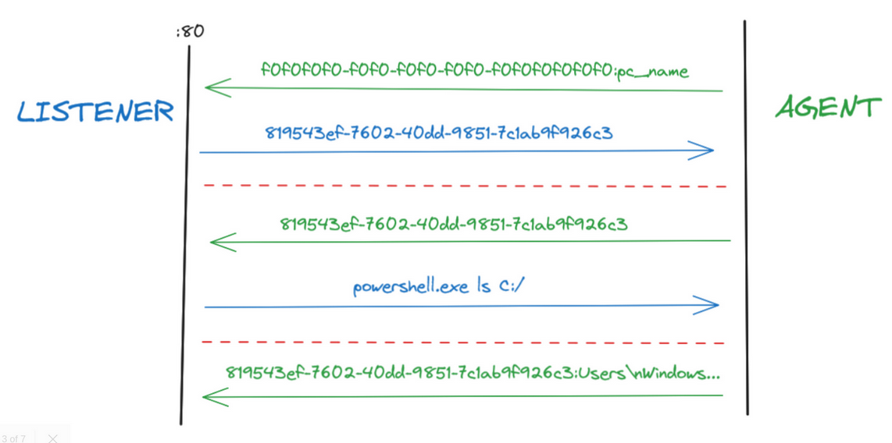
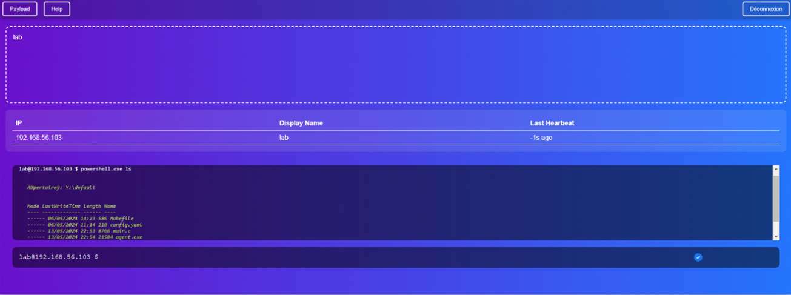
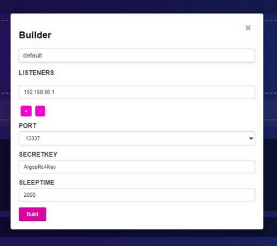

# ArgosC2


## Disclaimer

This is a student project to demonstrate a simple C2 architecture. Although it was built with realism in mind, it is not meant to be used during assessments, as it has not been stress-tested nor has all the needed features. The default agents do not have EDR bypass capabilities and would most likely get caught


## Infrastructure

Here's the C2 infrastructure schema:



As we can see, the agents (implants) do not connect directly to the server but instead go through listeners (which can be one or multiple). This provides the ability to hide the C2 server's IP from the client and instead use listeners as potentially "burner IPs". One could modify the default agent to allow dynamic listener addition, so that if a listener's IP is banned, another machine can be set up as a listener.

During our demonstration, we used a terraform infrastructure to automatically start 10 listeners waiting for agents requests.




And here's the agent's logs choosing randomly between listerners (not the same ips from last screen):



About agent communication, we implemented a custom communication protocol in order to identify agents. We decided not to use IPs as one IP could have multiple agents running (same for Device Name or ID).

Instead, when a new agent is started, it will try to reach a listerner and signal itself using a dummy UUID. The listener will recognize that this UUID is used for new agents and will contact the main server to retrieve a new UUID to give to the agent for its communications.



A really important point is that this protocol is designed to be "decentralised" (maybe not the best term) from listeners. This means, the listener that reveive the dummy UUID will not be the one that will send the registered UUID to the agent. In the same way, the listener that sends the powershell command to execute **will not be the same that will receive the output**.

## Interface

Here's what an operator, once logged-in with the credentials specified in the server config.yaml, have:



When new agents connects, they are added to the list in the top of the screen an can be selected individually to run commands.

From this view, the operator can build new agents executable and modify their configuration after having selected the desired agent:


This configuration comes from the config.yaml file of the default agent:
```yaml
LISTENERS: 
  type: "list"
  value: 
    - "192.168.56.1"
PORT: 
  type: "choice"
  value:
    - 80
    - 443
    - 13337
    - 56667

SECRETKEY:
  type: "single"
  value: "ArgosRc4Key"

SLEEPTIME: 
  type: "single"
  value: 2000
```

This is designed so that anyone can create their own configurable agent and use it with our C2. The current default agent is fully coded in C and uses RC4 to encrypt its communications. It has a virustotal detection of 4/74 but will probably be flagged by any EDR as it does not have any bypass nor obfuscation implemented and is simply here to demonstrate the C2 capabilities.

## Installation

On the main server:
```
$ git clone https://github.com/GamrayW/ArgosC2
$ sudo apt install libpq-dev 
$ pip install flask
$ pip install psycopg

$ cd ArgosC2/postgres_docker
$ sudo docker compose up -d
$ cd ../server
# Modify server config (profile.yaml)
$ python3 app.py
```

On a listener (using the default one):
```
$ git clone https://github.com/GamrayW/ArgosC2
$ cd ArgosC2/listeners/default
$ pip install pycryptodome
# Modify some constants in the listener.py file like ARGOS_SERVER_URL to point to your server
$ python3 listener.py
```
